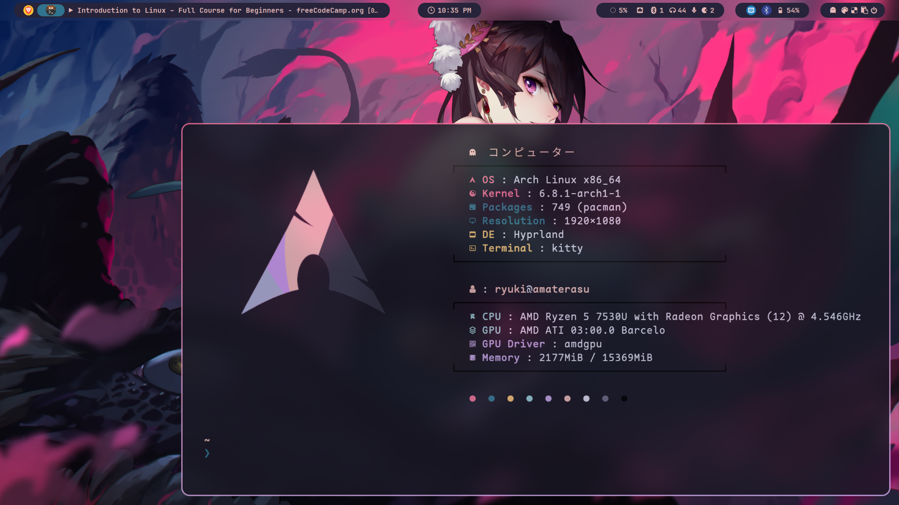

<h1 align="center">
    
     
        Ryuki
     
     
        For Arch linux users only
     
      

   

    

    

        <a>
            
        
        
    

    

</h1>

## TBA

See [PACCACHE.md](/Scripts/PACCACHE.md) for installing automated pacman & aur cache cleaner.
